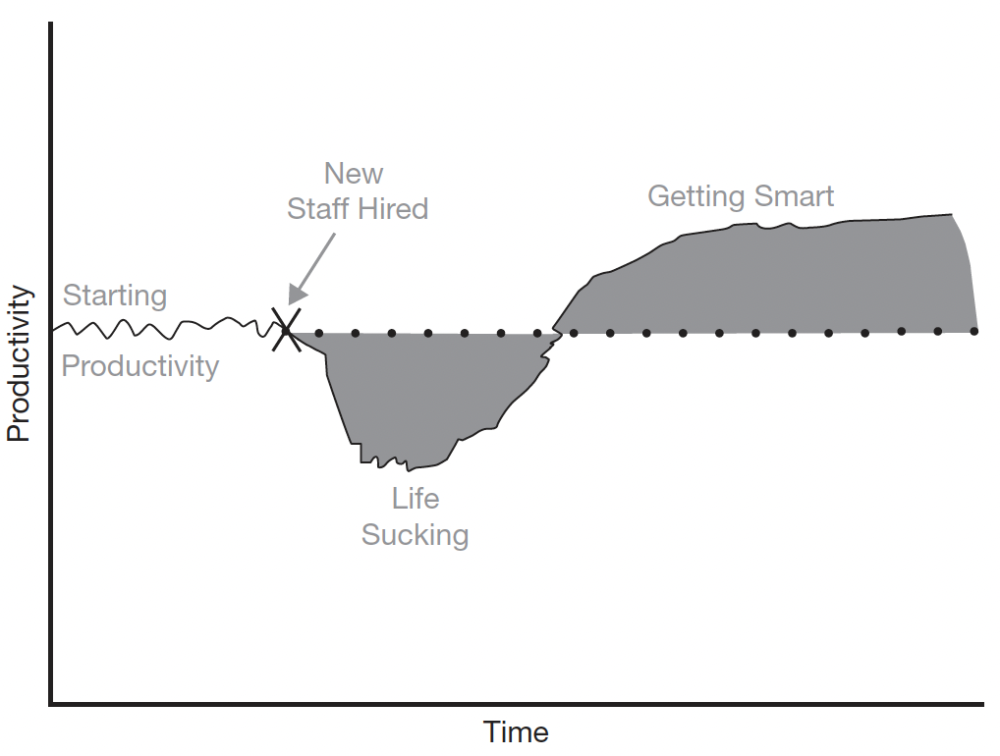
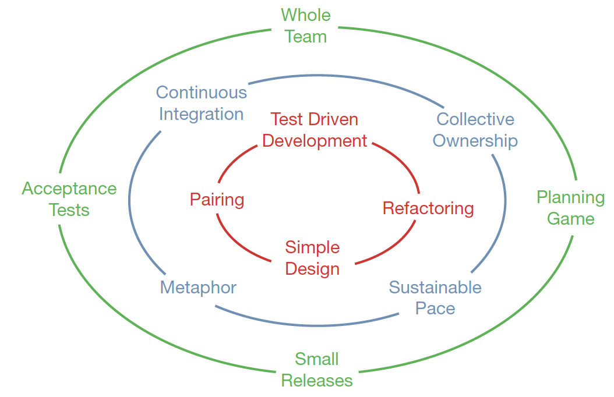

# Clean Agile - Back to Basics

Agile is a process wherein a project is subdivided into iterations.
The output of each iteration is measured and used to continuously evaluate the schedule. Features are implemented in the
order of business value so that the most valuable things are implemented first. Quality is kept as high as possible.
The schedule is primarily managed by manipulating scope.

## Agile produces data

Agile development is first and foremost a feedback-driven approach.
Each week, each day, each hour, and even each minute is driven by looking at the results of the previous week, day,
hour, and minute, and then making the appropriate adjustments.

## Iteration in Agile

Every iteration in the project, from the beginning to the end, will have some analysis, design and implementation in
it. In an Agile project, we are always analyzing and designing.

## Iron cross of project management

Good, Fast, Cheap, Done. Choose any 3, you can't have 4th

### Increasing staff

### Decreasing Quality

Producing crap does not make you go faster, it makes you go slower. This is the lesson you learn after you’ve been a
programmer for 20 or 30 years. There is no such thing as quick and dirty. Anything dirty is slow.
The only way to go fast, is to go well.

## Circle of life XP

### Outer Ring

Outer ring the business facing practices of XP.

- Planning game :  It tells us how to break down and schedule a project into features, stories, and tasks.
- Small releases : Guides team to work in bite-sized chunks
- Acceptance tests : Provide the definition of “done” for features, stories, and tasks.
- Whole team : Whole team conveys the notion that a software development team is composed of many different functions
                including programmers, testers and managers who all work together toward the same goal.

### Middle ring

Middle ring of the Circle of Life presents the team-facing practices.

- Sustainable pace : Practice that keeps a development team from burning their resources too quickly and running out of
                    steam before the finish line.
- Collective ownership : Ensures the team does not divide the project into a set of knowledge silos.
- Continuous integration : Keeps the team focused on closing the feedback loop frequently enough to know where they  
                            are at all times.
- Metaphor : The practice that creates and promulgates the vocabulary and language that the team and the business use
            to communicate about the system.

### Innermost ring

Represents the technical practices that guide and constrain the programmers to ensure the highest technical quality.

- Pairing : It is the practice that keeps the technical team sharing knowledge, reviewing, and collaborating at a level
            that drives innovation and accuracy.
        Pair programming strategy:
         - Driver-Navigator: One person (Driver) writes the code while the other (Navigator) reviews and
              suggests improvements.
         - Ping-Pong Pairing: One writes a test, and the other writes code to make the test pass, alternating
              roles frequently.
         - Mob Programming: If there are more than two developers, work as a team with clear rotations.
- Simple Design : It is the practice that guides the team to prevent wasted effort.
- Refactoring : It encourages continual improvement and refinement of all work products.
- Test Driven Development : It is the safety line that the technical team uses to go quickly while maintaining the
                            highest quality.

## XP with Agile

• Individuals and interactions over processes and tools
    Whole Team, Metaphor, Collective Ownership, Pairing, Sustainable Pace
• Working software over comprehensive documentation
    Acceptance Tests, Test Driven Development, Simple Design, Refactoring,
    Continuous Integration
• Customer collaboration over contract negotiation
    Small Releases, Planning Game, Acceptance Tests, Metaphor
• Responding to change over following a plan
    Small Releases, Planning Game, Sustainable Pace, Test Driven
    Development, Refactoring, Acceptance Tests

## Expectations of your CTO

### We will not ship shit

Any system that requires its users to think like programmers in order to enter data in the expected format is crap.

### Continuous technical readiness

At the end of each iteration all the coding, all the testing, all the documentation, and all the stabilization for the
stories should be implemented.

Is it possible for the system to be technically deployable every week or two?
Of course it is. The team simply has to pick a batch of stories that is small enough to allow them to complete all the deployment readiness tasks before the end of the iteration. They’d better be automating the vast majority of their
testing, too.

### Stable productivity

Customers and managers don’t expect software teams to slow down with time. Rather, they expect that a feature similar to
one that took two weeks at the start of a project will take two weeks a year later. They expect productivity to be
stable over time.
    Developers should expect no less. By continuously keeping the architecture, design, and code as clean as possible,
    they can keep their productivity high and prevent the otherwise inevitable spiral into low productivity and redesign.

### Inexpensive adaptability

Software is a compound word. The word “ware” means “product.” The word “soft” means easy to change. Therefore, software
is a product that is easy to change.

If a change to the requirements breaks your architecture, then your architecture sucks.
We developers should celebrate change because that’s why we are here.
Changing requirements is the name of the whole game. Those changes are the justification for our careers and our
salaries. Our jobs depend on our ability to accept and engineer changing requirements and to make those changes
relatively inexpensive.

### Continuous Improvement

The older a software system is, the better it should be.
The design and architecture of a software system should get better with time. The structure of the code should improve,
and so should the efficiency and throughput of the system.

### Fearless Competence

Why don’t most software systems improve with time? Fear. More specifically, fear of change.

### QA should find nothing

QA should find no faults with the system. When QA runs their tests, they should come back saying that everything works
as required. Any time QA finds a problem, the development team should find out what went wrong in their process and fix
it so that next time QA will find nothing.

### Test automation

Manual tests are always eventually lost.

However, there is a more insidious mechanism for losing manual tests.
Developers seldom deliver to QA on time. This means that QA has less time than planned to run the tests they need to run.
So, QA must choose which tests they believe are most appropriate to run in order to make the shipment deadline.
And so some tests aren’t run. They are lost.

And besides, humans are not machines. Asking humans to do what machines can do is expensive, inefficient, and immoral.
There is a much better activity for which QA should be employed—an activity that uses their human creativity and
imagination.

### We cover for each other

I don’t expect the team to keep knowledge in silos; I expect knowledge to be shared. If I need to reassign half the
members of the team to a new project, I do not expect that half the knowledge will be removed from the team.

### Honest Estimates

I expect estimates, and I expect them to be honest.

For example, you may not know how long something will take, but you can compare one task to another in relative terms.
You may not know how long it will take to build the Login page, but you might be able to tell me that the
Change Password page will take about half the time as Login. Relative estimates like that are immensely valuable.

### You need to say "NO"

I expect that, no matter how much schedule pressure you feel, no matter how many managers are demanding results, you
will say “no” when the answer really is “no.”

### Continuous Agressive Learning

As CTO, I expect you to keep learning. Our industry changes quickly. We must be able to change with it.
**So learn, learn, learn!** Sometimes the company can afford to send you to courses and conferences. Sometimes the
company can afford to buy books and training videos. But if not, then you must find ways to continue learning without
the company’s help.

### Mentoring

As CTO I expect you to teach. Indeed, the best way to learn is to teach. So when new people join the team, teach them.
Learn to teach each other.

### Customer Bill of rights

The customer bill of rights includes the following:
• You have the right to an overall plan and to know what can be accomplished when and at what cost.
• You have the right to get the most possible value out of every iteration.
• You have the right to see progress in a running system, proven to work by passing repeatable tests that you specify.
• You have the right to change your mind, to substitute functionality, and to change priorities without paying exorbitant
 costs.
• You have the right to be informed of schedule and estimate changes, in time to choose how to reduce the scope to meet
a required date. You can cancel at any time and be left with a useful working system reflecting investment to date.

### Developer Bill of Rights

The developer bill of rights includes the following:

• You have the right to know what is needed with clear declarations of priority.
    Developers are entitled to precision in the requirements and in the importance of those requirements.
• You have the right to produce high-quality work at all times.
    Business has no right to force developers to ruin their professional reputations or violate their professional
    ethics.
• You have the right to ask for and receive help from peers, managers, and customers.
    This help comes in many forms. Programmers may ask each other for help solving a problem, checking a result, or
    learning a framework, among other things. Developers might ask customers to better explain requirements or
    to refine priorities. Mostly, this statement gives programmers the right to communicate.
    And with that right to ask for help, comes the responsibility to give help when asked.
• You have the right to make and update your own estimates.
    No one can estimate a task for you. And if you estimate a task, you can always change your estimate when new factors
    come to light.
• You have the right to accept your responsibilities instead of having them assigned to you.
    Professionals accept work, they are not assigned work. A professional developer has every right to say “no” to a
    particular job or task. It may be that the developer does not feel confident in their ability to complete the task,
    or it may be that the developer believes the task better suited for someone else. Or, it may be that the developer
    rejects the tasks for personal or moral reasons.
        In any case, the right to accept comes with a cost. Acceptance implies responsibility. The accepting developer
    becomes responsible for the quality and execution of the task, for continually updating the estimate so that the
    schedule can be managed, for communicating status to the whole team, and for asking for help when help is needed.
        Programming on a team involves working closely together with juniors and seniors. The team has the right to
    collaboratively decide who will do what. A technical leader might ask a developer to take a task but has no right to
    force a task on anyone.

The mutual acceptance and conference of rights and expectations - this profession of disciplines - is the foundation
of an ethical standard for software.
