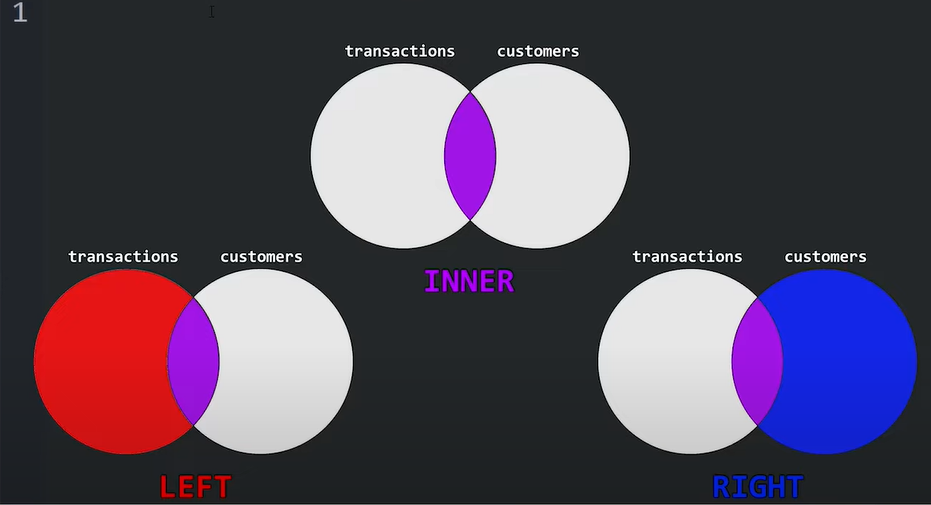

# Database Design

## Database normalization

Database normalization is useful because it minimizes duplicate data in any single table, and allows for data in the 
database to grow independently of each other.

## Joins

- INNER JOIN - Only keep rows where there is a match in both tables.

- OUTER JOIN - Keep all rows from one or both tables, even if there's no match. (Missing values filled with NULL)

- JOIN (INNER JOIN)

- FULL JOIN (FULL OUTER JOIN)
    Take everything from both left and right tables. Wherever there is no match, fill NULL.

- LEFT JOIN (LEFT OUTER JOIN)

- RIGHT JOIN (RIGHT OUTER JOIN)

```sql
SELECT * FROM movies as m inner join boxoffice as bo on m.id=bo.movie_id
```



## NULL

You can test a column for NULL values in a WHERE clause by using either the IS NULL or IS NOT NULL constraint.