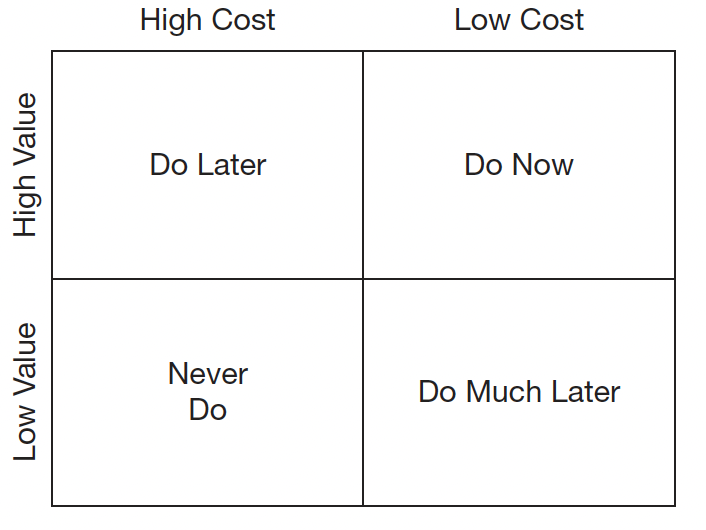

# Business practices

## Stories and Points

A user story is an abbreviated description of a feature of the system, told from the point of view of a user.
Refactoring is never a story. Architecture is never a story. Code cleanup is never a story. A story is always something
that the business values. Don’t worry, we will deal with refactoring, architecture, and cleanup—but not with
stories.

Story points are a unit of estimated effort, not real time. They are not even estimated time—they are estimated effort.

## Return on investment

